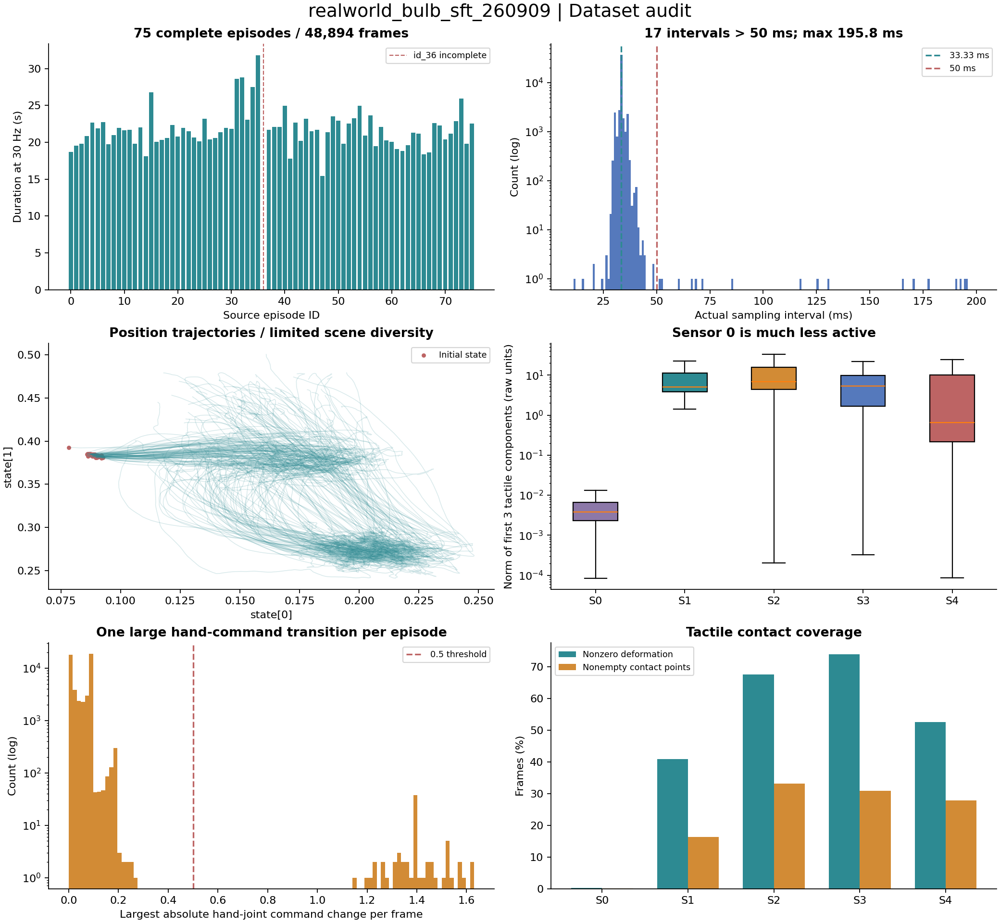

**realworld_bulb_sft_260909 数据集分析**

数据源：`/home/bighand/wangtianyu/projects/TacMP/data/realworld_bulb_sft_260909`。分析日期：2026-09-09。

这是一个单任务、固定场景的真实机器人多模态操作数据集。75 条轨迹在结构和数值上完整，可以作为模仿学习的数据候选；使用前最需要处理的是未完成保存的 `id_36`、手部动作的阶段切换，以及触觉通道的接触覆盖差异。结构完整不等于任务成功，当前没有成功/失败真值标签。

[打开离线画面浏览页](index.html) · [统计图 PDF](overview.pdf) · [逐轨迹 CSV](episodes.csv) · [各维度 CSV](dimensions.csv) · [完整轨迹清单](complete_episode_manifest.json)

**规模与组织方式**

| 项目 | 结果 |
|---|---|
| 任务文本 | `screw the light bulb into the socket` |
| 机器人类型 | `franka_sharpa` |
| 元数据版本 | `codebase_version: v2.1`，LeRobot 风格 |
| 根目录布局 | `rank_0/id_0` 到 `rank_0/id_75`，共 76 个子目录 |
| 完整轨迹 | 75 条；排除 `id_36` 后为 48,894 帧 |
| 标称采样频率 | 30 Hz |
| 标称累计时长 | 1,629.8 秒，即 27.16 分钟，以帧数 / 30 计算 |
| 单轨迹长度 | 463–954 帧；中位数 646，均值 651.92 |
| 单轨迹标称时长 | 15.43–31.80 秒；中位数 21.53 秒 |
| 最短 / 最长 | `id_47` / `id_35` |
| 采集时间范围 | 2026-09-09 00:27:37–03:41:54，UTC+8；包含轨迹间间隔 |
| 文件总量 | 1,767 个文件，35.63 GB / 33.19 GiB；包含未完成目录 |

每个完整 `id_*` 都是一个独立的单 episode 数据集：包含 `meta/info.json`、`meta/episodes.jsonl`、`meta/episodes_stats.jsonl`、`meta/tasks.jsonl`、一个数据 Parquet 和一个 timing Parquet。每个子数据集内的 `episode_index` 都是 0，`index` 从 0 重新开始。根目录本身并非一个已经合并的多 episode 数据集，不能仅拼接表后保留这些重复编号。原始元数据的 `splits` 全是 `train: 0:1`，尚无验证集划分。

**字段与含义**

| 字段 | 每帧形状 / 类型 | 内容与使用注意 |
|---|---|---|
| `state` | `(31,) float32` | 按现有项目约定为位置 3 + 旋转 6D + 手部关节 22 |
| `actions` | `(31,) float32` | 数值与绝对目标位姿/关节命令一致；不应直接当作增量 |
| `image` | `(480,640,3)`，PNG bytes | 从画面看为外部相机视角 |
| `extra_view_image` | `(480,640,3)`，PNG bytes | 从画面看为随手臂运动的近景视角 |
| `tactile_f6` | `(5,6) float32` | 项目可视化脚本按 `[Fx,Fy,Fz,Mx,My,Mz]` 解释 |
| `tactile_deform` | `(5,240,240) uint8` | 五个传感器的形变图，不能当作普通三通道 RGB |
| `tactile_contact_points` | string | JSON 编码的五路可变长接触点列表，需要先解析 |
| `done` | bool | 每条轨迹仅最后一帧为 True，共 75 个 True |
| `segment_id` | uint8 | 全部 48,894 帧均为 0，未提供阶段区分 |
| `timestamp` | float32 | 从 0 开始的均匀 30 Hz 时间网格 |
| 索引字段 | int64 | `frame_index`、`episode_index`、`index`、`task_index` |

31 维拆分参考本项目 [data2dp.py](/mnt/work/dexIL/Dex_Diffuse/scripts/data2dp.py:9) 和 [direct_robot_env.py](/mnt/work/dexIL/Dex_Diffuse/direct_robot_env.py:820) 的位姿约定；六维触觉含义参考 [vis_tac_data_video.py](/home/bighand/wangtianyu/projects/TacMP/scripts/vis_tac_data_video.py:13)。本数据集 `features.names` 没有写出各关节名、五路触觉到手指的映射、触觉单位或标定信息，因此接入训练/控制端前仍需核对原始采集配置。报告不把传感器 S0–S4 直接命名为某根手指，也不把触觉数值直接解释为 N。

图像实际嵌入 Parquet 的 `struct<bytes,path>` 中，`path` 只是类似 `frame_000000.png` 的名称。完整轨迹没有单独的 PNG 文件夹，也没有 MP4；根目录下发现的 1,315 张独立 PNG 全部来自未完成的 `id_36`。读取器应优先解码 bytes，不能依赖完整轨迹中不存在的外部 PNG 路径。

**完整性检查**

75 条完整轨迹使用一致的数据 schema。数据行数与 `info.json`、`episodes.jsonl`、timing 表行数一致；帧索引连续，timing 的帧索引和标称时间戳与主数据一致。全量扫描状态、动作、六维触觉，未发现 NaN/Inf 或外层空值；数值数组形状符合声明。未发现整条状态+动作序列完全相同的重复轨迹。

两个相机合计 97,788 张图像：全部检查了 bytes 非空、PNG 文件头/结尾，以及同轨迹同相机的相邻字节哈希；未发现异常或字节完全一致的相邻图像。每条轨迹每路相机均匀抽取 5 帧，共 750 张完整解码，尺寸与 RGB 模式正常，无全黑图、无解码错误。此检查不等于对全部 PNG 逐张完整解码，也不能排除带有像素噪声的视觉卡顿。

`id_36` 的保存状态明确不完整：

- `info.json` 的 `total_frames=0`、`total_episodes=0`。
- 缺少正式 `data/...parquet`，也缺少 `episodes.jsonl`、`episodes_stats.jsonl`、`tasks.jsonl`。
- `image` 留下 658 张 PNG，索引 0–657；`extra_view_image` 留下 657 张，索引 0–656。
- `.pending-*` 中有一个 826 行的 timing Parquet，和残留图像数不一致。
- 占用约 476.30 MB。仅凭这些残留图像和 timing 无法恢复缺失的状态、动作与完整触觉序列。

默认训练清单应排除 `id_36`，保留原始目录便于后续追查。分析过程未改动源数据；低维扫描前后所有源文件的大小与修改时间一致。

**时序与同步**

真实采样间隔来自 `timing.sample_monotonic_ns`，而非主表的均匀 `timestamp`。

| 指标 | 结果 |
|---|---|
| 各轨迹有效频率的平均值 | 29.848 Hz |
| 各轨迹有效频率范围 | 29.379–29.898 Hz |
| 全部实际帧间隔 | 均值 33.505 ms；中位数 33.444 ms；P99 36.973 ms |
| 超过 50 ms 的间隔 | 17 / 48,819，即 0.0348% |
| 最长间隔 | 195.797 ms，`id_72` 第 89→90 帧，按 0 起始索引 |
| 触觉接收时间到采样时间的差值 | 中位数 16.35 ms；P99 32.26 ms；最大 173.53 ms |
| 同帧五路触觉接收时间跨度 | 中位数 24.64 ms；P99 31.96 ms；最大 171.32 ms |
| 触觉 frame id 相邻重复 | 1,485 / 244,095 路间隔，约 0.608% |
| 触觉 frame id 倒退 | 0 |

触觉上述时间差表示接收样本的新鲜程度，不是经过硬件标定的端到端延迟。frame id 大于 1 的间隔共有 9,882 个，这说明两次采样间跳过了触觉帧编号，但不能直接等同于传感器丢包：异步更新频率高于记录频率也会产生此现象。现有 timing 中没有两路相机的独立曝光时间，无法据此验证相机和触觉的精确硬件同步。

重点复核 `id_7、id_65、id_71、id_72、id_73`，这些轨迹包含超过 100 ms 的间隔。单条轨迹最大的累计时间偏差约 0.50 秒。做速度、接触时刻或延迟分析时应使用 timing；用于固定频率训练时，应明确按真实时间重采样，或标记这些间隔附近的训练窗口。不能简单假定所有相邻帧始终相隔 1/30 秒。

**状态、动作与阶段切换**

状态和动作的第 3–8 维组成两个近似单位正交向量：范数误差和点积绝对值均不超过约 `5.96e-8`，与合法的旋转 6D 表示一致。位置状态覆盖 `[0.0783,0.2481] × [0.2412,0.5007] × [0.3554,0.6485]`；按现有项目米制约定约为 17 × 26 × 29 cm。起始位置高度集中，画面也显示同一工位和相近物体摆放，泛化范围需在新摆位、新光照下另外验证。

动作与观测状态并不相同：前三维欧氏差均值 0.01321，P95 0.03500；按项目米制约定约 1.32 cm / 3.50 cm。手部 22 维平均绝对差的全帧均值为 0.05917；每条轨迹第一帧的该误差中位数为 0.32347，明显大于全帧中位数 0.05671。初始命令和实际手姿存在差距，不能把两列视为可互换的数据，也不能仅凭此差距断定记录错位。

以“相邻帧手部命令任一维变化超过 0.5”为筛选条件，75 条轨迹各出现一次，共 75 次，跳变量范围 1.144–1.630。切换发生后到最后一帧之间还有 72–129 个帧间隔，即约 2.4–4.3 秒；从切换帧起算共 7,421 帧，占整个数据集 15.18%。例如 `id_18` 第 490→491 帧的单维最大变化为 1.630。

对切换附近画面的复核显示，灯泡已点亮，机器人随后松手、撤离；这些跳变与释放/恢复手姿的阶段切换一致。这是结合画面的解释，尚未找到原始采集端切换逻辑。不要未经复核就平滑或删掉这些动作，也不要自动把它们标注为故障。若训练目标只覆盖抓取和拧入，可人工确认后截取；若需要完成松手撤离，应保留并补充阶段标记。候选切换帧已保存到 [candidate_phase_boundaries.csv](candidate_phase_boundaries.csv)，不是真值分段标签。

`segment_id` 恒为 0，`done` 仅标识结束，元数据没有 reward、success 或 failure 字段。终帧和抽样过程画面可以用于人工复核，但不能据此报告经过验证的 100% 成功率，也不能从目录中的 `sft` 推断每条轨迹均已通过质量筛选。

**触觉覆盖与数值特征**

| 传感器索引 | 前三维向量模长中位数（原始单位） | 模长 > 1 的帧比例 | 非零形变帧比例 |
|---|---:|---:|---:|
| S0 | 0.00380 | 0.46% | 0.32% |
| S1 | 5.033 | 100.00% | 40.89% |
| S2 | 6.774 | 92.99% | 67.69% |
| S3 | 5.327 | 80.68% | 73.96% |
| S4 | 0.656 | 43.22% | 52.68% |

所有通道的六维值都不是全程为零。S0 有 157 帧非零形变，形变最大值 130；其前三维模长最大值 17.07，因此不能直接判定该传感器损坏。更可能的待核实因素包括该手指很少接触、通道映射、接触位置和标定状态。应先核对映射和无接触基线，再决定是否排除某通道。S1 模长始终大于 1，但形变仅约 41% 的帧非零，也提示“模长 > 1”只是统计阈值，不能直接当作接触真值。

五路形变全为零的帧为 5,076，即 10.38%；五路接触点列表全为空的帧为 16,196，即 33.12%。二者比例不同，说明这两种表示不能简单互换；零形变/空接触点也不自动意味着数据缺失。

`tactile_f6` 虽保存为 float32，但全量数值转换到 float16 再转回后完全一致，说明其有效精度不超过 float16。这与上游半精度量化一致，但具体来源仍需采集端确认。归一化统计应按通道和分量分开计算，仅使用训练集；力与力矩、弱信号通道和强接触通道不应混用一个全局标量尺度。

**接入训练的建议顺序**

1. 用完整轨迹清单加载 75 条，排除 `id_36`。合并时重建全局 episode/frame 索引或 Zarr 的 `episode_ends`，避免窗口跨轨迹边界。
2. 核对 31 维状态/动作的手关节顺序、动作时刻含义、绝对目标约定、相机映射与触觉单位；元数据未充分描述这些语义。
3. 人工确认候选释放阶段和最终成功状态。保留完整行为或截取操作阶段，应由模型预期执行的任务边界决定。
4. 按整条轨迹划分训练/验证，例如先做 60/15；避免相邻帧随机拆分造成泄漏。当前全部来自同日、同工位，验证误差主要反映同场景表现，应额外采集新摆位/光照的评估轨迹。
5. 标记长采样间隔和过旧触觉附近的窗口。若重新采样，旋转部分应按旋转表示处理，避免逐维插值后破坏旋转约束。
6. 若先做现有多模态策略基线，可使用双视角图像、31 维状态和 `(5,6)` 触觉，预测 31 维命令，再对是否加入形变图做受控对比。接触点字符串需解析成明确的张量表示及有效点掩码。

存储方面，两路图像占主数据 Parquet 压缩列体积的 99.14%。低维分析或仅使用六维触觉时应投影读取所需列；训练时按相机分辨率需求建立一次预处理缓存，避免每轮重复展开全部原始 PNG 和形变数据。当前自定义字段是 `state/actions/image` 等，使用预设读取器前应显式映射字段名。

**检查范围与产物**

本次全量扫描 75 条完整轨迹的状态、动作、六维触觉、接触点 JSON、形变图和 timing。所有相机 bytes 做结构与相邻重复检查，750 张均匀样本完整解码，另查看切换附近与终帧画面。没有对残留 `id_36` 做训练数据恢复，没有验证机器人控制标定或任务成功真值。

分析脚本为 [analyze.py](analyze.py)、[inspect_media.py](inspect_media.py)、[build_report.py](build_report.py)。环境使用已有 `tianji` Python，额外将 PyArrow 安装在 `/tmp/bulb_dataset_analysis_deps`，未改动现有训练环境依赖。完整数值结果见 [summary.json](summary.json)、[media_summary.json](media_summary.json)、[additional_findings.json](additional_findings.json)。

